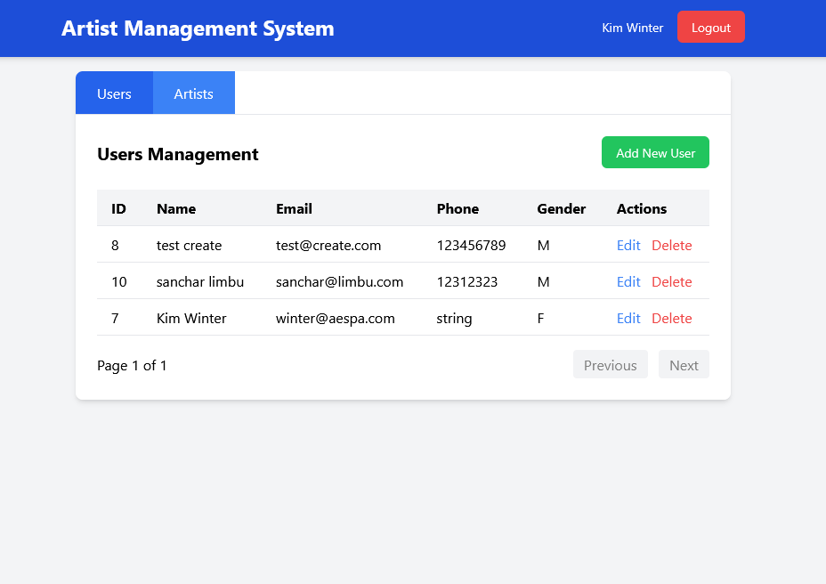
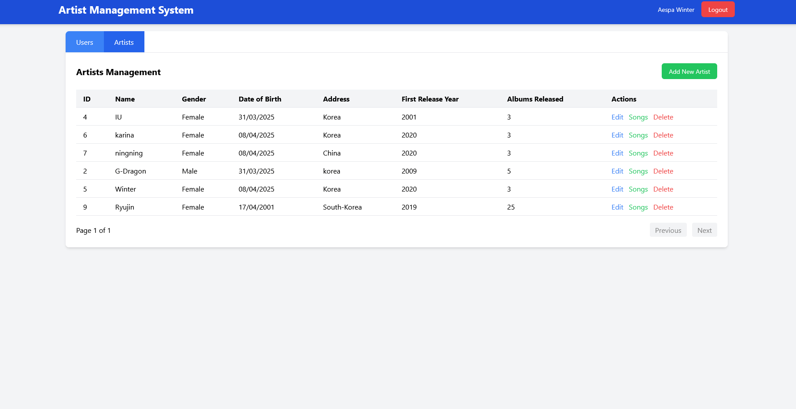

# Artist Management System

A modern web application for managing artists, built with FastAPI, PostgreSQL, and TailwindCSS.

## Features

- FastAPI backend with automatic API documentation
- PostgreSQL database with SQLAlchemy ORM
- Modern UI with TailwindCSS
- Docker containerization for easy deployment
- Database migrations with Alembic
- Authentication and authorization system

## Screenshots

<div align="center">
  
  <p><em>Users Management</em></p>
  
  
  <p><em>Artists Management</em></p>

  <p>View more screenshots in the <a href="./screenshots">screenshots directory</a>.</p>
</div>

## Tech Stack

- **Backend**: FastAPI, Alembic (Database Migration)
- **Frontend**: TailwindCSS, htmx, i might use Alpine.js
- **Database**: PostgreSQL
- **Containerization**: Docker, Docker Compose
- **Development Tools**: Python, Node.js (for postcss only)
- **Testing**: pytest

## Prerequisites

- Docker and Docker Compose
- Python 3.11+
- Node.js and npm
- Git

## Getting Started

1. Clone the repository:

   ```bash
   git clone https://github.com/zczqas/Simple-Admin-Panel.git
   cd simple-admin-panel
   ```

2. Set up environment variables:

   ```bash
   cp .env.example .env
   # Edit .env with your configuration
   ```

3. Start the application using Docker Compose:

   ```bash
   make dev
   ```

4. For local development:

   a. Set up Python virtual environment:

   ```bash
   python -m venv .venv
   source .venv/bin/activate  # On Windows: .venv\Scripts\activate
   pip install -r requirements.txt
   ```

   b. Install Node.js dependencies:

   ```bash
   npm install
   ```

   c. Build CSS:

   ```bash
   npm run build:css
   ```

   d. Start the development server:

   ```bash
   make dev
   ```

   e. Start the development server and view logs:

   ```bash
   make dev-live
   ```

   or

   ```bash
   make dev

   make dev-logs
   ```

## Project Structure

```text
simple-admin-panel/
├── app/                    # Main application code
├── static/                 # Static files and CSS
├── migrations/             # Database migrations (Generated by alembic but handrolled SQL)
├── init.sql/              # Database initialization scripts
├── dist/                  # Compiled assets
├── docker-compose.yml     # Docker Compose configuration
├── Dockerfile             # Docker configuration
├── requirements.txt       # Python dependencies
├── package.json          # Node.js dependencies
└── tailwind.config.js    # TailwindCSS configuration
```

## Development

- Watch CSS changes:

  ```bash
  npm run watch:css
  ```

- Run database migrations:

  ```bash
  alembic revision -m "migration message"

  alembic upgrade head
  ```

- Run tests:

  ```bash
  make test test=test_file_name
  ```

## API Documentation

Once the application is running, you can access:

- Swagger UI: http://localhost:8000/docs
- ReDoc: http://localhost:8000/redoc
- Frontend: http://localhost:8000/static/
